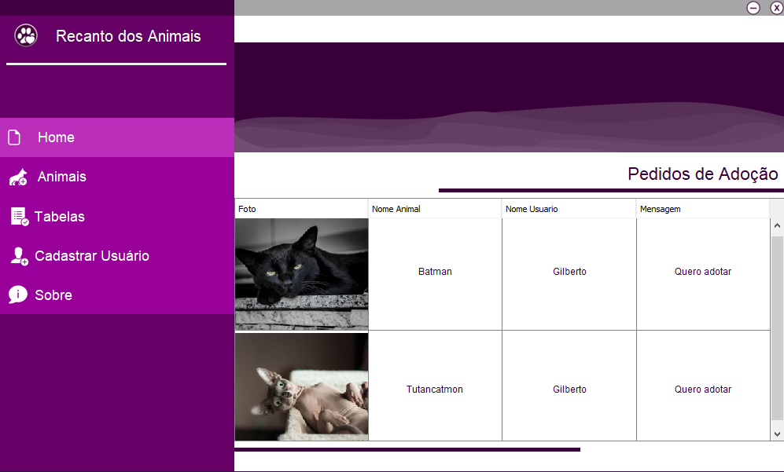
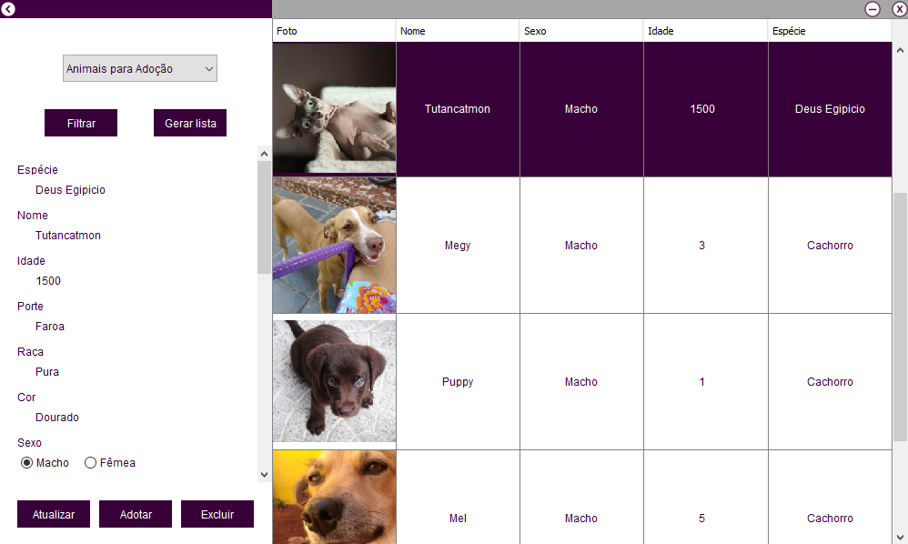

#  Projeto Recanto

Projeto realizado em 2018 como trabalho das disciplinas de Programação, Banco de Dados e Projeto de Software do Instituto Federal de Minas Gerais - Campus Ouro Branco, envolvendo a comunidade da cidade e a Ong Recanto dos Animais, o projeto foi descontinuado e finalizado em 2022.

## IDE de Desenvolvimento

NetBeans IDE 

Exemplo de Instalação:

```bash
https://www3.ntu.edu.sg/home/ehchua/programming/howto/netbeans_howto.html
```

## Banco de Dados

### MySql Workbench

Instalação:

```bash
https://dev.mysql.com/downloads/workbench/
```


# Aplicativo em Funcionamento
### Home


### Cadastro Animal


### Tabelas


### Adotar


### Cadastro Usuário


### Sobre


## License
[MIT](https://choosealicense.com/licenses/mit/)
